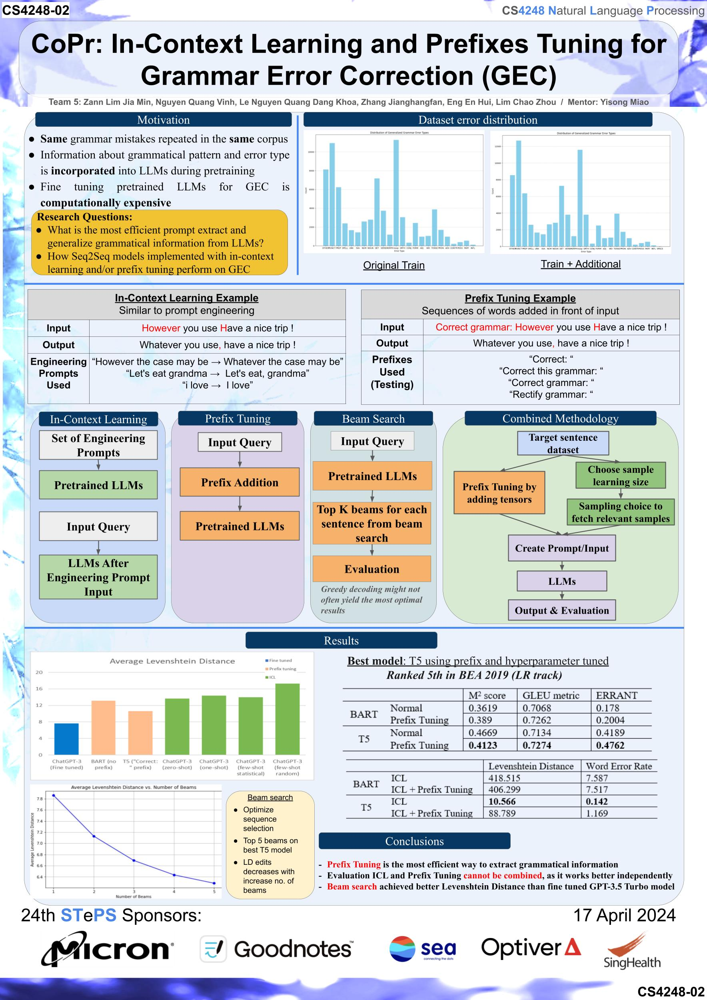

# CS4248-Team-5-AY2324
CoPr: In-Context Learning and Prefixes Tuning for Grammar Error Correction (GEC)

## Context Problem
Communication is a huge part of our way of life, grammatical errors can sometimes lead to misunderstandings while communicating especially in the absence of body languages. Credibility of the text may also seem less credible and impactful when the text is filled with grammatical errors.

## Description
Grammatical errors have different types, these include using wrong tenses or spelling errors. A person generally has a tendency to make the same type of errors subconsciously. By evaluating the type of error a person has already made, we can decrease ‘False Negatives’ knowing that these are errors the person is prone to make. Hence, Large Language Models (LLM) may be able to pick up these tendencies and adjust their outputs accordingly. Being able to pick up certain tendencies will allow us to adjust the model’s output to have more confidence in predicting the same type of tendencies. Our Seq2seq model has achieved this through “In-Context Learning (ICL)” and “Prefix Tuning”.

## Contributions
We propose to utilize in-context learning (ICL) and prefix tuning to train large language models to identify grammatical error patterns and tendencies in english sentences/essays written by the same author.

## Dataset
Data was acquired from the [Write & Improve (WI) Locnesss dataset](https://www.cl.cam.ac.uk/research/nl/bea2019st/) with over 43k of text data.
